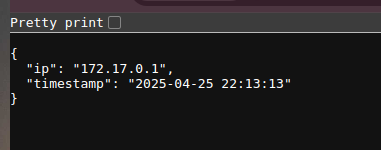

# application-deployment
🌐 A minimal web service deployed with containers on AWS using Terraform. Covers containerization, cloud hosting (EKS/ECS/Lambda), and full infra-as-code setup.

# Terraform & Helm Infrastructure Deployment Guide

## Overview
This guide provides steps to deploy infrastructure using Terraform with secure S3 state storage/DynamoDB locking, followed by application deployment using Helm charts.

## Prerequisites
- AWS CLI configured
- Terraform ≥1.6
- Helm ≥3.0
- kubectl configured

## Deployment Steps

### Initialize Terraform
```hcl
terraform init
```

### Preview changes
```hcl
terraform plan -out=tfplan
```

### Apply infrastructure
```hcl
terraform apply "tfplan"
```
## Deploying through workflow:
You can deploy terraform code using workflow.
follow the guide for [deployment using workflow](.github/workflows/Terraform_README.md)

# Docker & Helm Application Deployment Guide
After provisioning infrastructure with Terraform, follow these steps to containerize your app and deploy it using Helm.

## Prerequisites
- Docker installed and running

- DockerHub or ECR account (or another container registry)

- Helm chart ready for deployment.

- AWS EKS configured 

- kubectl connected to your cluster
### 1. Reach to the SimpleTimeService folder
```bash
cd SimpleTimeService
```

### 2. Build Docker Image
```bash
docker build -t <yourusername>/<yourapp>:<tag> -f <Dockerfile-path> <build-context>
```
🔁 Replace <yourusername>/<yourapp> with your DockerHub repo and <tag> with a version or commit SHA.

Example:
``` bash

docker build -t myuser/myapp:latest -f ./SimpleTimeService/Dockerfile ./docker/app
```

### 3. Push Docker Image to Registry
``` bash
docker login
docker push <yourusername>/<yourapp>:<tag>
```
Example:
```bash
docker push myuser/myapp:latest
```
### 4. Deploy with Helm
Make sure your Helm chart has image configuration like this in values.yaml:
```bash
cd SimpleTimeService/flask_app
```

``` yaml
image:
  repository: myuser/myapp
  tag: latest
```
### 5. Run Helm Upgrade/Install
``` bash
helm upgrade --install myapp-release . \
  --wait \
  --timeout 15m \
  --set service.type=LoadBalancer \
  --set image.repository=myuser/myapp \
  --set image.tag=latest \
  --atomic
  ```
📦 This will install or upgrade your app in the Kubernetes cluster with a LoadBalancer service.

## Deploying Through Workflow
You can automate the Docker build, push, and Helm deployment using GitHub Actions.

[📄 See CI/CD Workflow Guide for full details](.github/workflows/deploy_README.md).

# Output
you can see the external ip of load balancer service 
```bash
kubectl get svc flask-app 
```
enter that ip with 5002 port you can see the outputlike below on your browser.
